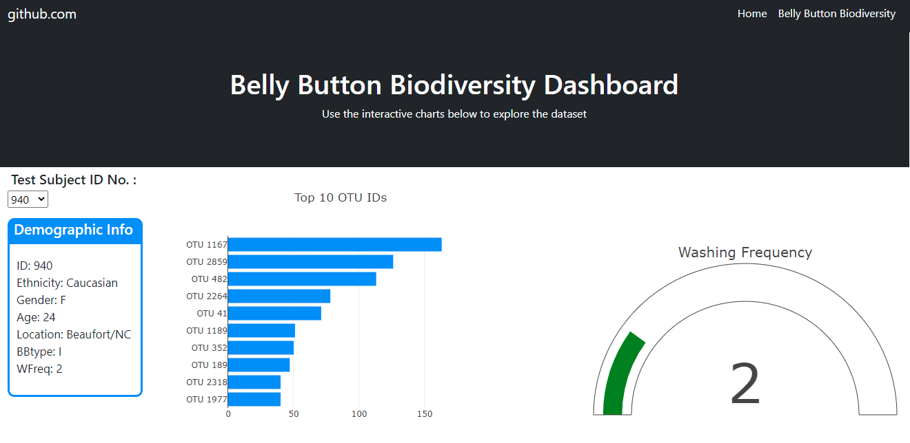
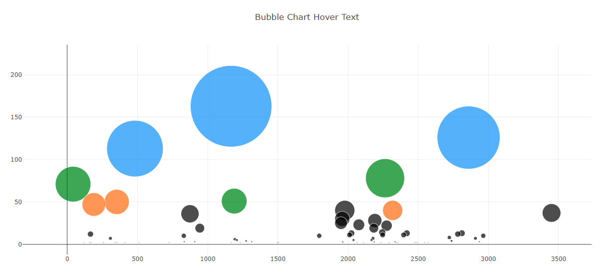

# Plotly Challenge

For this challenge, I've built an interactive dashboard to explore the [Belly Button Biodiversity dataset](http://robdunnlab.com/projects/belly-button-biodiversity/), which catalogs the microbes that colonize human navels.  

The dataset reveals that a small handful of microbial species (also called operational taxonomic units, or OTUs, in the study) were present in more than 70% of people, while the rest were relatively rare.  

In this challenge, we create data visualizations using Plotly, a horizontal bar chart, a bubble chart, and a gauge visual.  These visualizations can be updated by the user choosing a patient ID from the dropdown list.

